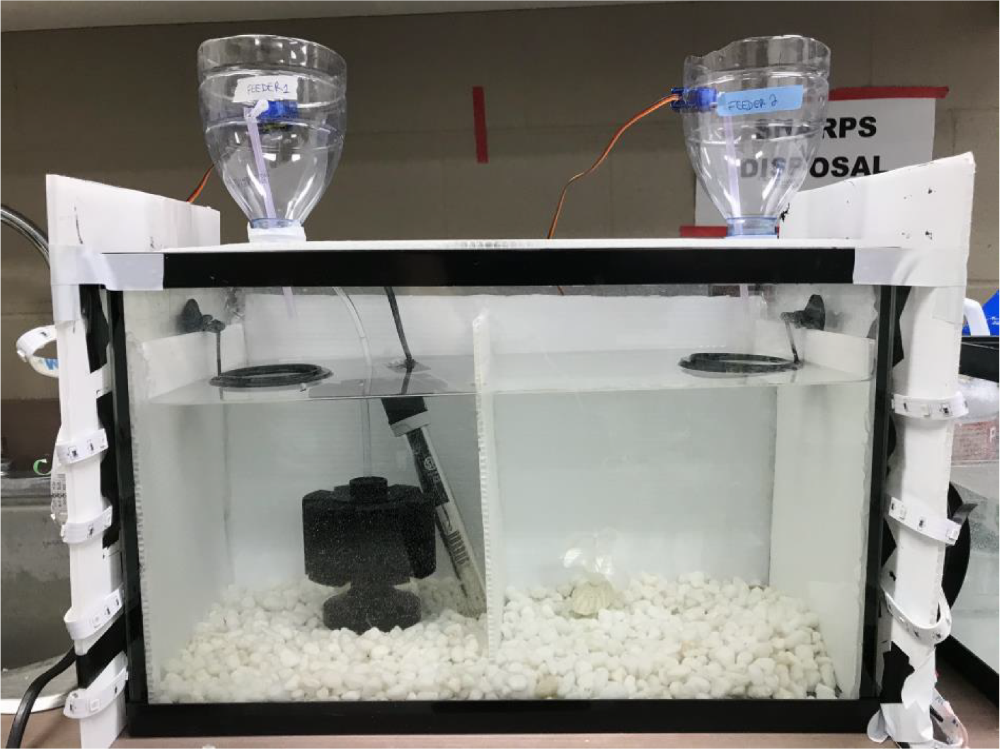
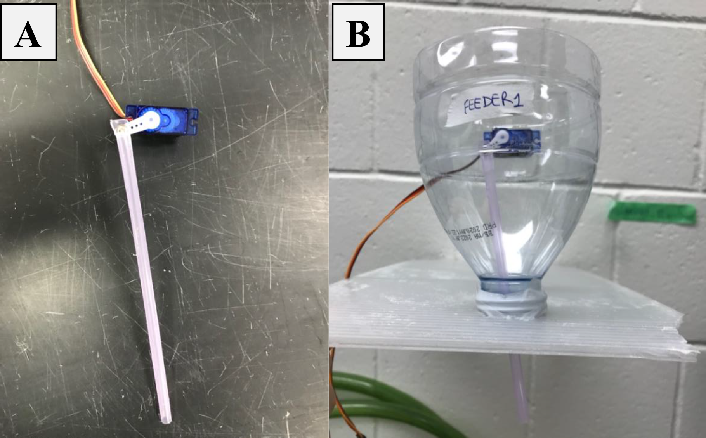
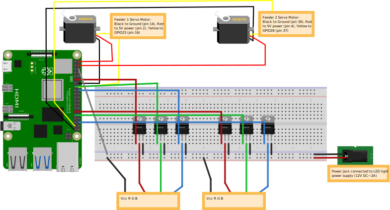

<div class="topnav">
<a href="index.html">Guppy automated learning chamber project site</a> 
<a href="https://github.com/wyatt-toure/guppy-automated-learning-chamber" style = "float: right;">GitHub</a>
<a href="analysis.html" style = "float: right;">Analysis</a> 
<a href="python-code-documentation.html" style = "float: right;">Python Code Documentation</a> 
<a class="active" href="apparatus-setup.html"style = "float: right;">Apparatus Design</a>
<a href="manuscript.html" style = "float: right;">Manuscript</a>
<a href="index.html" style = "float: right;">Home</a>
</div>

## Overview

The aim of GLoW is to create an apparatus based on a Raspberry Pi computer that
can be used in learning experiments for fish in a home tank. This iteration of
GLoW (GLoW version 1) is designed to pair a light stimulus with the presentation
of food at one of two feeders placed in the home. The side of the tank the light
shines on predicts which feeder will have food delivered with food being
delivered on the same side as the light. In addition to conducting the
experiment the Raspberry Pi used for GLoW is also fitted with a Raspberry Pi
camera so that the apparatus can simultaneously conduct and record the
experiment.

## Required Equipment

-   Raspberry Pi 4
-   Raspberry Pi camera v2
-   Raspberry Pi camera ribbon cable extension
-   Male to female jumper cables
-   Female to female jumper cables
-   LED strip lights
-   Breadboard
-   MOSFETS
-   Ring feeders
-   Servo motors (TowerPro used here)

## Tank Design

The tank for the conditioning chamber was a single 5-gallon glass tank
(length: 40 cm x width: 20 cm x height: 25 cm). The tank was fitted with white
gravel, a white aquarium plant, a thermometer, a heater and a sponge filter. The
tank was also fitted with white corrugated plastic walls to improve the contrast
between guppies and the background of the tank so that guppy positional data
could be collected with automated tracking. If behaviour is being recorded
manually then this is optional.

```{r tank-photo, echo=FALSE, out.width="100%", fig.cap="Automated chamber picture. Cable connections and Raspberry Pi set-up omitted"}

```

At both lengthwise ends of the tank were custom-made automated feeders and LED
strip lights wrapped around a plastic board. Each automated feeder was placed
above a black feeding ring of 5 cm diameter so that the food delivered to one
side of the tank would not drift around the tank. White walls covered three
sides of the tank, leaving 5 cm uncovered near the top of the tank for the
placement of feeding rings. The tank design for our automated chamber is
depicted in Figure 1. A Raspberry Pi 4 equipped with a Raspberry Pi 4 camera v2
was positioned to face the side of the tank so it captured the full length of
the tank.

## Automated Feeder Design

The feeders for GLoW are very inexpensive to make. Each feeder is made out of
a 1-liter plastic bottle, a 10 cm long plastic straw and a servo motor (Tower
Pro SG90) which can be seen in Figure \@ref(fig:feeder-photo).

The bottles, which make up the body of the feeder, are cut at about 15 cm from
their top (the bottom part is not needed and can be discarded). A small
rectangular section is cut out 5 cm below that initial cut so that the servo
motor can fit through it. A 5 mm hole is made at one end of a straw so we can
connect it to the wing of a servo motor with a 2 mm by 8 mm machine screw. The
straw is positioned so that 3 cm of the straw would be stick outside the mouth
of the bottle. Electrical tape is then used to cover the empty space around the
tip of the straw coming out of the bottle. Finally, the feeder is filled to
about 5 cm with crushed food flakes (Tetramin).

```{r feeder-photo, echo=FALSE, out.width="100%", fig.cap="A) Plastic straw attached to servo motor. B) Final feeder design, with a servo motor connected to the straw and the bottle supported by the cover of the tank."}

```

Once activated via a Python script, the servo motor moves its wing up and down
in three steps, moving the straw and pumping the feeder to release food into the
tank through the two holes of the pen. Feeders were tested to make sure that
flakes remained dry and did not absorb humidity when left in the set up for long
periods of time (over 7 days). The consistency of the feeders was also verified
to ensure they would pump the same amount of food each time they were activated.

## Raspberry Pi Electronics Setup

The Raspberry Pi wiring is depicted in Figure \@ref(fig:GLoW-wire-diagram). More
detailed information will be written here soon.

```{r GLoW-wire-diagram, echo=FALSE, out.width="100%", fig.cap="Wire diagram for GLoW"}

```
