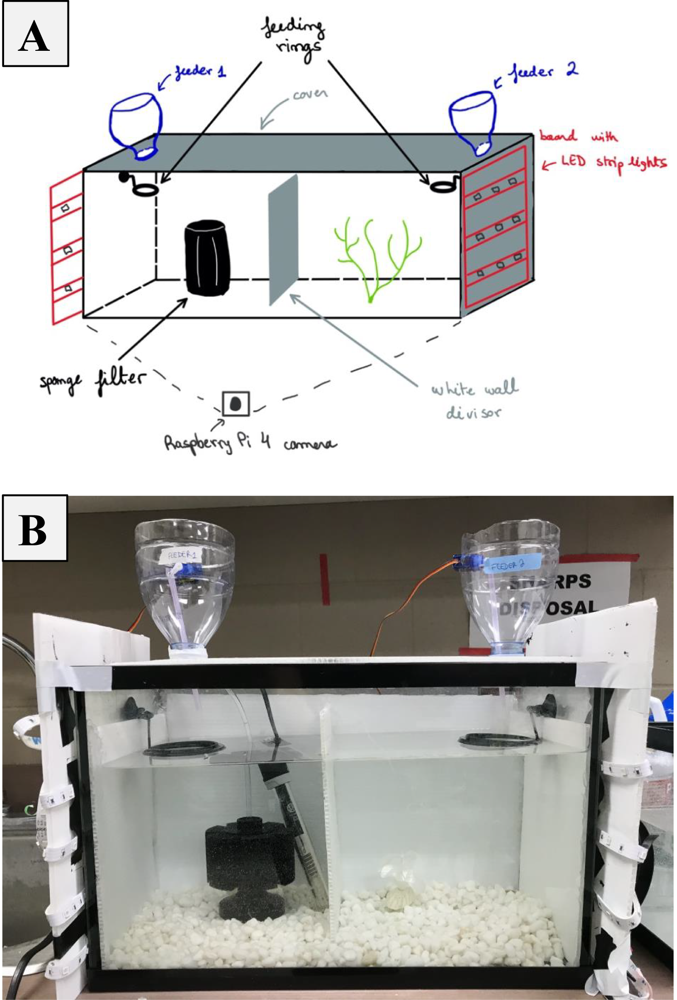
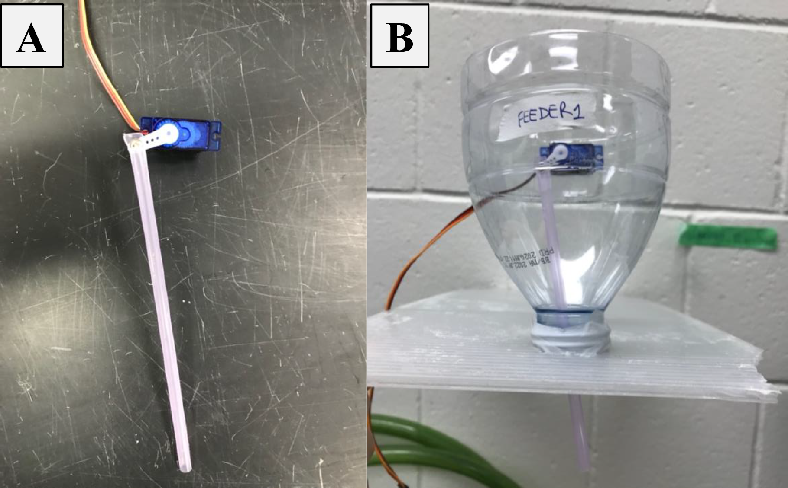
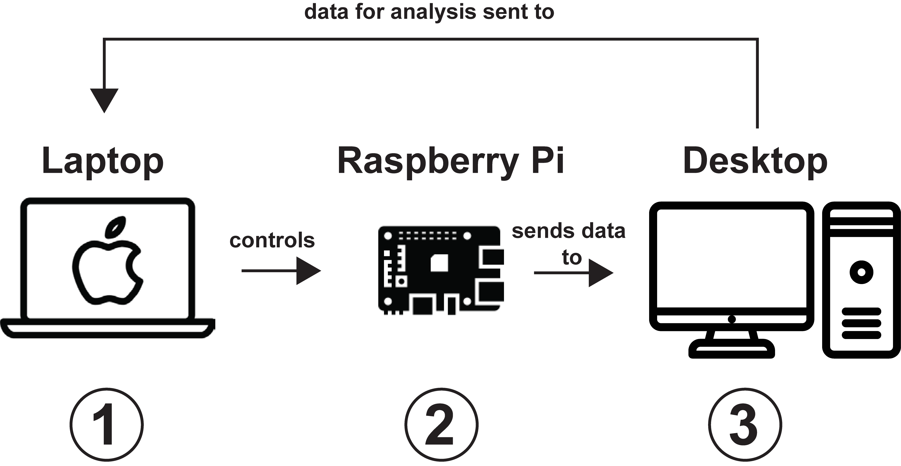
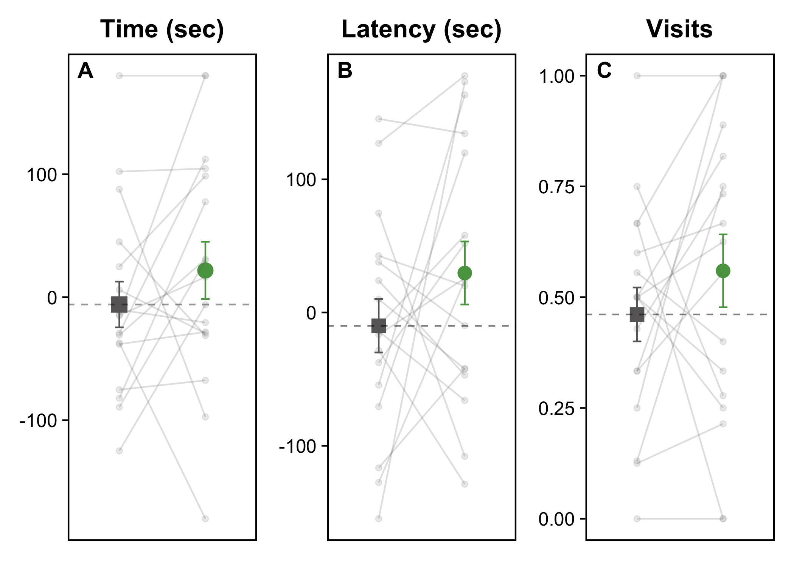
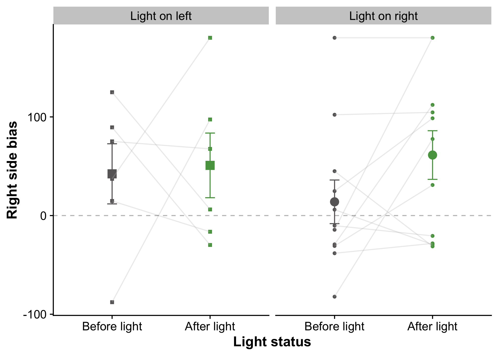

<div class="topnav">
  <a href="index.html">Guppy automated learning chamber project site</a>
    <a href="https://github.com/wyatt-toure/guppy-automated-learning-chamber" style = "float: right;">GitHub</a>
    <a href="analysis.html" style = "float: right;">Analysis</a>
    <a href="python-code-documentation.html" style = "float: right;">Python Code Documentation</a>
    <a href="apparatus-setup.html"style = "float: right;">Apparatus Design</a>
    <a class="active" href="manuscript.html" style = "float: right;">Manuscript</a>
    <a href="index.html" style = "float: right;">Home</a>
</div>

<p class="author-name">Beatriz Romero Quineche<span class="affil-mark">1*</span></p>

<p class="author-affil"><span class="affil-mark">1</span>McGill University, Department of Biology, 1205 Docteur Penfield, Montreal, Quebec H3A 1B1, Canada</p>

***

## Introduction 

Replication is a cornerstone for virtually all scientific research, particularly
within biology. It allows us to increase confidence in patterns and trends in
our data, as well as estimating the inherent variability of data. The main
requirement for satisfactory replication is standardization. It is crucial that
replication must be as standardized as possible so that when repeated at larger
scales, researchers can have more confidence in the data acquired. However,
standardization of experiments can be particularly challenging for studies of
animal behaviour, which often involve direct observation of animals in their
natural habitats (Martin et al., 1983) or animal training and handling for
studies conducted in the laboratory (Crabbe et al., 1999; Hurst & West, 2010).
Another challenge to the replication of studies in animal behaviour is the
variability related to behaviour, such as individual variation in behavioural
types, variation in behavioural plasticity and behavioural predictability
(Hertel et al. 2020).

For behavioural studies conducted in the laboratory, the challenge in
standardization becomes particularly evident due to the many potentially
confounding variables that come along this line of work, such as observer and
identity effects. Observer effects have been defined by Iredale et al. 2010 as
how a human observer impacts the behaviour of animals being observed. On the
other hand, identity effects are a subset of observer effects which are mainly
focused on the identification of the human observer by the animal (van Driel &
Talling, 2005). These effects have been shown to affect subject behaviour, thus
impacting the reliability of measurements and eventually biasing the findings of
studies (Tuyttens et al., 2014). The observer effect has been particularly
evidenced across several taxa, from mammals (Iredale et al. 2010), to birds
(Duncan, 1992), invertebrates (MacFarlane & King, 2002) and fish (Chapman et
al., 1974). The identity of the experimenter and their familiarity to the tested
animals has also been shown to have significant effects on the behaviour of
subjects (van Driel & Talling, 2005). Another possible bias to consider is the
expectancy effect (Rosenthal & Lawson, 1964), in which the experimenter’s
observations of an animal’s behaviour may be subconsciously biased by the
experimenter’s expectations for the experiment.

One way to address these problems is by designing automated methods for the
studies in question. In doing so, one can reduce external disturbances, increase
sample sizes and training times, as well as obtain more standardized and precise
training schedules for learning experiments, thus leading to a more confident
understanding of individual and group behaviour (Poddar et al., 2013).

It is important to note that the automation of large-scale experiments can be
expensive. As many research projects rely on specialized electronic devices and
software to gather data, the automation of experiments with such expensive
equipment can quickly become unattainable for many researchers. However, recent
advances in the affordability and accessibility of technology have substantially
helped solving this issue. The automation of experiments has been particularly
facilitated by the use of open-source hardware and software like the Raspberry
Pi and Arduino devices (Greenville & Emery, 2016). The Raspberry Pi (Raspberry
Pi Foundation, 2021) is in particular a high-performance microcomputer that has
been extensively adopted by researchers to develop projects using the Python
programming language and compatible tools such as camera modules and third-party
wireless modules (Nayyar & Puri, 2015; Cagnetti et al. 2013). In behavioural
studies, the Raspberry Pi has been notably used for imaging and subject
recognition (Senthilkumar et al., 2014).

A number of studies in animal behaviour investigate animal learning, a change in
behaviour that occurs either as a result of a direct experience or by
observation of another individual’s experience. Typical learning experiments
pair stimuli such as lights or sounds with rewards, often in response to an
animal’s behaviour. In birds and rodents, automated learning designs have been
successfully employed, including in wild populations (Aplin et al. 2015). In
a 2015 Nature study, Aplin et al. automated feeding chambers in which passive
integrated transponder tagged birds could learn to operate around a large field
site in Wytham Woods in Oxford, UK. This allowed for powerful insights into the
diffusion of learned behaviours across wild populations which would not be
feasible or be extremely challenging without the use of automation. However,
this automation approach has not yet been widely adopted for fish behavioural
studies due to various practical constraints (e.g., difficulty of placing
electronic components in water, thermal tracking software not working due to
water disturbance, size of fish). Our project aims to solve some of these
constraints by developing an affordable automated chamber allowing for the live
tracking of small fish and the conduction of behavioural experiments in the
laboratory.

Guppies (*Poecilia reticulata*) are a social species of freshwater fish that are
well studied in various fields of biology including vertebrate ecology,
genetics, evolution, and animal behaviour (Magurran et al., 1995). Learning is
important for guppies as it contributes to the development of their foraging
abilities and antipredator behaviour (Brown & Laland, 2001). Currently there is
interest in understanding the mechanisms underlying different forms of learning,
such as social learning (Reader, 2016). Therefore, developing automated
approaches for guppy behavioural work would be of great value for this field
because it would substantially facilitate the collection of the standardized
data needed for such studies. In order to establish an automated method for
conducting behavioural experiments in guppies, we have designed an automatic
feeder and used Raspberry Pi 4s and Python programming for the automated
conduction of learning experiments for guppies. To validate whether learning was
possible with this method, we conducted a learning experiment where fish would
learn that a light stimulus predicts feeding time. This simple training regime
was to act as proof-of-concept, i.e., to establish whether we could observe fish
learning with this automated set- up.


## Methods 

### Subjects and housing conditions

Subjects were laboratory-reared fish of Iso-Y genotype originating from the
Paria drainage of Trinidad. Fish were previously housed in 19-litre tanks
(*l* 20 x *L* 40 x *h* 25 cm) before being moved to the training and testing
tanks of same dimension. Housing tanks were enriched with natural gravel,
aquarium plants, a thermometer, a heater and a sponge filter. Fish were kept on
a 12:12h light:dark cycle (7am to 7pm), at 25 ± 1 °C . Fish were fed crushed
flake food daily (TetraMin Tropical Flakes, Tetra, Germany) and decapsulated
brine shrimp eggs (Brine Shrimp Direct, USA) three times a week prior to the
experiment.

A total of 38 fish were used during the course of this project, 18 of them being
the final test subjects for our final automated chamber design and the other 20
being the test subjects for the previous chamber prototypes (not reported here).

### Tank design 

A single 19-litre glass tank (*l* 20 x *L* 40 x *h* 25 cm) was used for both
training and testing purposes. This avoided the potential stress of moving fish
between tanks for behavioural tests. The tank was provided with white gravel, a
white aquarium plant, a thermometer, a heater and a sponge filter. Water
temperature was kept at 25 ± 1 °C.

At opposite ends of the tank were a custom-made automated feeder and a board of
LED strip lights (5-meter LED Light Strip with 150 LEDs, Inscrok) attached to
the side of the tank. The board was made so that four strips with 6 LEDs each
were illuminating the side of the tank at an intensity of 125 units (Figure S1).
This light intensity was optimal because it allowed for only half of the tank to
be illuminated while also not being too bright that guppies would avoid it. Each
automated feeder was also coupled to a black feeding ring of diameter 5 cm so
that the food delivered to one side of the tank did not drift around the tank.
White walls covered three sides of the tank, leaving 5 cm uncovered near the top
of the tank for the placement of feeding rings. Finally, a Raspberry Pi 4
equipped with a Raspberry Pi 4 camera v2 was positioned to face the side of the
tank so it captured its full length. The tank design for our automated chamber
is depicted in Figure 1. In total, there were three replicates of this set-up.

</br>

```{r figure-1, echo=FALSE, out.width="75%", fig.cap="A) Sketch of main tank design. Tank heater, gravel, cable connections and Raspberry Pi set-up were omitted for clarity. B) Automated chamber picture. Cable connections and Raspberry Pi set-up omitted"}

```

### Automated feeders 

Each feeder (Figure 2) was made out of a 1-liter plastic bottle, a 10 cm long
and 5 mm wide plastic straw and a servo motor (Tower Pro SG90).

The bottles, which would make up the body of the feeder, were cut at about 15 cm
from their top, discarding the bottom part. A small rectangular section was then
cut out 5 cm below that initial cut so that a servo motor could fit through it.
A 5 mm hole was made at one end of the straw so we could connect the latter to
the wing of a servo motor with a 2 by 8 mm machine screw. The straw was
positioned so that a length of 3 cm would be just outside the mouth of the
bottle (Figure 2B).

</br>

```{r figure-2, echo=FALSE, out.width="75%", fig.cap="A) Plastic straw attached to servo motor. B) Final feeder design, with a servo motor connected to the straw and the bottle supported by the cover of the tank."}

```

White electrical tape was used to cover the empty space around the tip of the
straw coming out of the bottle. Finally, the feeder would be filled to about 5
cm with crushed food flakes (Tetramin Tropical Flakes, Tetra, Germany).

Once activated via a Python script, the servo motor would move its wing up and
down in three steps, moving the straw and pumping the feeder to release food
into the tank. Feeders were tested to make sure that flakes remained dry and did
not absorb humidity when left in the set up for long periods of time (over 7
days). The consistency of the feeders was also verified to ensure they would
pump the same amount of food each time they were activated. Lastly, the amount
of food delivered by the two feeders was also verified to be the same across
both feeders to avoid side biases in reinforcement.

### Experimental control equipment and software

A remote access control software (VNC Server/Viewer) was used to remotely access
the Raspberry Pi 4, which would in turn control the automated chamber through
custom Python scripts. All Python scripts written for this project can be
reviewed at the project’s GitHub project page and in the project’s website, both
linked in the Appendix section. Figure 3 depicts the full control pipeline of
the experiment.

</br>

```{r figure-3, echo=FALSE, out.width="75%", fig.cap="Full control pipeline of the automated chamber. Every device in this network had remote control. The laptop (1) would remotely access the Raspberry Pi (2) via VNC (Virtual Network Computing) to activate the lights, feeders, and cameras of the automated chambers. The footage of the experimental trials would then be sent to a desktop (3) with a video tracking software package (EthoVision XT version 11.5, Noldus et al., 2001) via SSH (Secure shell) file transfer where the behaviour would be quantified with computer vision. The data from the tracked footage would then be sent back to the laptop (1) where they would be analyzed using R statistical software (R Core Team, 2021)."}

```

The Raspberry Pi 4 was connected to a Raspberry Pi camera module and placed 20
cm from the tank to record the data needed for the experiment. Analysis of the
recordings was done using a commercially available video tracking software
package (EthoVision XT version 11.5, Noldus *et. al.* 2001). Tracking data was
checked for inconsistencies and errors were manually corrected before running
statistical analysis using R statistical software (R Core Team, 2021).

A BB830 solderless breadboard, six 3 N-channel MOSFETs, jumper wires (male to
female and male to male), two LED strip lights and a 12V power supply were used
for the light set-up. The set-up’s connections and the entire circuit designed
are described in detail on the ‘set-up’ file found at the project’s GitHub repo.
A fritzing diagram describing the entire circuit created for this project is
illustrated in Figure 4.

```{r figure-4, echo=FALSE, out.width="100%", fig.cap="Fritzing diagram of entire circuit designed for an automated chamber. The full description of connections and materials required can be found in the project’s Github page, linked in the Appendix section."}
knitr::include_graphics("docs/static/images/raspberry-pi-wiring-diagram.svg")
```

### Learning experiment

The conducted experiment was a simple learning test in which guppies would be
trained that a light cue predicts food delivery and location. When one of the
two sides of the tank had its lights activated, the fish would be fed on that
side. With three automated chambers, we were able to train 6 fish per week,
with 2 guppies in each tank.

#### *Training*

A training trial consisted of activating one of the two LED lights for a
duration of five seconds prior to the activation of its corresponding feeder, so
the light acted as a feeding cue for guppies. This short-delay conditioning was
used to improve the chances of observing anticipatory behaviour, which could be
used as an indicator for learning. The side to be picked for a given training
trial was randomized each time, with the condition that within a training day,
both sides would have been activated the same number of times to avoid side
biases. After lights had been turned off, the feeder was activated to pump food
into the tank. The lights that were used as a feeding cue were chosen to be
green, as the latter has been shown to be a useful color for guppy learning
experiments (Toure & Reader, in prep.).

Each group of fish (a pair of female guppies) were trained four times a day for
a period of three days total. The four training sessions were done 2 hours apart
from one another, the first trial starting at 9am (the next ones at 11am, 13pm
and 15pm). After three days of training, fish would not be fed for one day
before a test trial (see section 2.5.2) was run on the following day. This was
done to allow for fish to become food-motivated and to ensure that any food
odours dissipated prior to a test trial.

#### *Testing*

Fish were tested individually at 9am the day after the non-feeding day. Fish
that had been trained in pairs were then briefly separated for testing. The
guppy not being tested was placed in a temporary tank, identical to their
training/testing tank while the other underwent the test trial in their original
training tank.

A test trial consisted of activating the lights from one of the two feeders
without activating the feeder itself and observing whether fish swam towards the
side with lights or not. The side that was activated at testing time was always
on the opposite side of the last training trial so that one could avoid having a
feeding cue at the same location of their last training. Prior to testing (but
not training), sponge filters were removed from tanks to ensure tracking
software to run smoothly.

If guppies swam towards the side with lights or swam up to the surface on that
side as an attempt to look for food, this would provide evidence that they have
learned that light predicts food delivery location. We expected that fish which
had learned that light predicts food would spend more time near the feeder ring
that had its light activated when compared to a baseline during the previous 3
minutes and that they would visit that feeder more rapidly compared to that
baseline measurement.

#### *Procedure*

The training and testing sessions were recorded by the Raspberry Pi 4 camera.
Recordings had a total duration of 6 minutes and 5 seconds. Recording was
initiated 3 minutes prior to the beginning of the stimulus and concluded 3
minutes and 5 seconds after, so that a three-minute baseline and a three-minute
measurement of the post-stimulus response could be obtained (5 seconds of
recording in between the two measurements being for the light activation
period). EthoVision XT tracking software (version 11.5, Noldus *et. al.* 2001)
was used to automatically collect fish positional data (more in section 2.6).
The amount of time spent within a 11 by 6 cm area around the feeders before and
after the lights were triggered was used as a measure of feeder choice. Sample
videos of both training and test trials are available for review under the
project’s Github page, linked in the Appendix section. A total of 18 female
guppies were trained and tested, but one female passed away before it could be
tested, resulting in 17 female guppies tested in total.

### Statistical analysis

We analysed the data using linear mixed effect and generalized linear mixed
effect models in R (version 3.6.2) with the lme4 package. P-values and effective
degrees of freedom were obtained using the lmerTest package. Model residuals
were checked they met distributional assumptions with the DHARMa package.

#### *Model 1: Time on rewarded side*

To determine whether individuals increased their time spent on the side of the
tank the light shone from, we fit a linear mixed effects model with fixed effect
of light status (before or after) as well as a random effect of individual id.
Our response variable, ‘rewarding side preference’, was the amount of time a
guppy spent on the side which the light shone from subtracted by the time spent
on the other unlit side of the tank. That is, a positive value represents more
time spent near the lit side relative to the unlit side. This model asked
whether the preference for the rewarding side of the tank changed between
baseline and test and whether this differs with light status.

#### *Model 2 - Latency to the rewarded side*

To determine whether individuals increased the speed at which they came within
three body lengths of the rewarded feeder relative to the unrewarded feeder
after the light turns on, we fit a linear mixed effects model. Our response
variable ‘latency difference’ was the latency to approach the unrewarded feeder
subtracted by the latency to approach the rewarded feeder. Positive values
indicate that the rewarded feeder was approached quicker than the unrewarded
feeder. The fixed effect was the light status which is either ‘before the light
turns on’ or ‘after the light turns on’. We additionally fit a random effect of
individual id to account for repeated measures.

#### *Model 3 - Visits to the rewarded feeder*

To determine whether individual increased the frequency with which they come
within two body lengths of the rewarded feeder, we fit a binomial generalized
linear mixed effects model. Our response variable was the proportion of visits
to the lit unrewarded feeder. This model asks whether the proportion of visits
to the lit unrewarded feeder differs between light phases. We fit a random
effect of individual id to account for repeated measures.

## Results

During training, fish fed readily from the feeders. During test, all guppies
visited at least one of the two feeders and spent on average 43% of the trial
near one of the two feeders.

| Factor       | Estimate | Std. Error | T statistic | df     | P value |
| ------------ | -------- | ---------- | ----------- | ------ | ------- |
| Intercept    | -5.918   | 21.084     | -0.281      | 29.473 | 0.781   |
| Light status | 27.671   | 25.075     | 1.104       | 16.000 | 0.286   |

Table: Table 1: Summary of a linear mixed effect model (Model 1) estimating the
time spent on the side of the tank where light had been activated (model
estimates ± S.E.) where the fixed effect is the factor light status (‘before the
light’ or ‘after the light’) and the random effect of individual id. The effect
of light status is non-significant, but the estimate indicates guppies
approached the rewarding feeder quicker than the unrewarding feeder after the
light came on.


| Factor       | Estimate | Std. Error | T statistic | df   | P value |
| ------------ | -------- | ---------- | ----------- | ---- | ------- |
| Intercept    | -9.941   | 21.928     | -0.453      | 32   | 0.653   |
| Light status | 39.612   | 31.011     | 1.277       | 32   | 0.211   |

Table: Table 2: Summary of a linear mixed effect model (Model 2) estimating how
fast guppies approached the unrewarded feeder for which the light had been
activated over the unrewarded feeder with no lights activated (model estimates ±
S.E.) where the fixed effect is the factor light status (‘before the light’ or
‘after the light’). The effect of light status is non-significant, but the
estimate indicates guppies approached the rewarding feeder quicker than the
unrewarding feeder after the light came on.


| Factor       | Estimate | Std. Error | T statistic | P value |
| ------------ | -------- | ---------- | ----------- | ------- |
| Intercept    | -0.108   | 0.238      | -0.455      | 0.649   |
| Light status | 0.399    | 0.254      | 1.568       | 0.117   |

Table: Table 3: Summary of a binomial generalized linear mixed effects model
(Model 3) estimating the proportion of visits guppies made to the activated
light side’s feeder (model estimates ± S.E.) where the fixed effect is the
factor light status (‘before the light’ or ‘after the light’). The effect of
light status is non-significant, but the estimate indicates guppies increase
their visits to the unrewarding feeder after its corresponding light had been
activated.


We found that after the light cue came on, guppies spent on average 27.7 s more
time on the light-cued side, visited the light-cued side faster, and increased
by 10% the proportion of visits to the light-cued side, all compared to the
other feeder location (Tables 1-3; Figure 5). However, none of these differences
reached statistical significance (Tables 1-3).

```{r figure-5, echo=FALSE, out.width="100%", fig.cap="Data are means ± SE. Dashed lines represent mean values for the pre-light baseline of the behaviour being displayed. Grey squares represent means of the pre-light baseline measures and green circles represent means of the post-light measures (period of time after lights have been triggered and turned off). Grey circles and lines represent the individual-level data. Lines connect individuals across light periods (‘pre-light’ and ‘post-light’) (A) Plot of the activated light side preference, y-axis is seconds. Positive values indicate a preference for the side of the tank with the previously rewarding feeder. (B) Plot for unrewarding feeder with activated lights latency bias in seconds, y-axis is in seconds. Positive values indicate that the feeder was approached quicker than the unlit feeder. (C) Plot for visits to unrewarded feeder with activated lights, y-axis is proportion of visits to the feeder. Positive values indicate an increase in the number of visits to the feeders after light cue."}

```

## Discussion 

In this study, we present an affordable, modular and fully automated training
system for simple guppy learning experiments. With some minor modifications, our
automated chamber could be used to automate other protocols relying on
reward-based learning in the laboratory.

In previous fish studies, fully automated methods for the conduction of learning
experiments had been proven to be successful for zebrafish and guppies (Manabe
et al., 2013; Luccon-Xiccato et al., 2018). Luccon-Xiccato et al. 2018 used
automation to investigate potential enhanced colour discrimination learning
abilities in guppies compared to other discrimination abilities such as shape.
We thus expected that our automated chamber would also be able to achieve
successful training and thus that guppies are able to learn with our automated
methods.

The simple learning experiment conducted during the course of this project,
where light stimulus would predict feeding time, revealed that our initial
expectations of successful training with automated methods seemed to be met.
While we did not observe any significant effects of our light-cue training on
guppy feeder choice at test, we do note that on all three measures of feeder
choice, fish had a non-significant preference for the light-cued feeder.

There are, however, some limitations to the data acquired for this study. To
begin with, our sample of guppies had high levels of variation, leading to
estimates with wide confidence intervals. Our sample size was also relatively
small, so the decrease in estimate precision due to sampling error was
amplified. There could be several reasons for such variation.

Since we did not explicitly quantify performance during training, it may be that
the guppies that did not perform any of the behaviours suggesting they had
learned that light predicts feeding time during testing were just not performing
well during training sessions in the first place. In fact, these guppies might
have not been feeding as much as the other fish that were actively learning the
light-food association, thus leading to different performances on the test trial
later. Several studies have addressed this issue with the employment of learning
criterions, which would allow animals to move on to the next phase of an
experiment provided they had passed an initial learning criterion (Lucon-Xiccato
& Bisazza, 2014; Batabyal & Thaker, 2019). For future studies, instead of
testing all trained guppies, we could potentially proceed with test trials only
for individuals that had made at least 70% of their visits to the side where
lights had been activated during training. If we simply assume guppies did
receive similar reinforcement during training, there may still be variation due
to individual differences in the expression of learned behaviour.

There is in fact evidence that individual animals differ in learning
performance. For example, Gibelli et al. 2019 shows that there was a significant
difference in the performance of highly anxious fish, sailfin mollies, compared
to others in learning tasks, so differences in learning speed were related to
individual anxiety and not exploration. Individual guppies may express learning
in different manners. Some may choose to spend more time on the side with the
feeder while others may choose to make more visits to the feeder. In this case,
the strongest and most common responses are more likely to produce statistically
significant estimates as they will have less variance. We might expect latency
to be a particularly noisy measure because it depends on where an individual was
in the tank when the light came on. By chance, individuals may have been further
away or closer to the feeder when the light came on which could produce
additional variation on the latency metric. The low precision on the estimate of
the effect of light status on time spent on the rewarding side of the tank may
be due to side biases. While non- significant, guppies that had the light shine
on the right side of the tank during testing increased their preference for the
right side of the tank after the stimulus more than the guppies that had the
light shine on the left side of the tank increased their preference for the left
side of the tank (Figure 6.). This could be an artefact of sample size - since
activated light sides were under random assignment for tests, we happened to
have nearly double the guppies for which the light shone on the right side of
the tank versus the left (11 on the right vs 6 on the left).

```{r figure-6, echo=FALSE, out.width="100%", fig.cap="Data are means ± SE. Dashed lines represent mean values for the pre-light baseline of the behaviour being displayed. Grey squares represent means of the pre-light baseline measures and green circles represent means of the post-light measures (period of time after lights have been triggered and turned off). Grey circles and lines represent the individual-level data. Lines connect individuals across light periods (‘pre-light’ and ‘post-light’). For the ‘light on the left’ guppies, there appears to be a slight bias but this may be an artefact of sample size (the confidence interval around the mean is very wide). There are 6 guppies for which the light shone on the left while there are almost double the guppies for which the light shone on the right (11 guppies). There were no significant effects for side bias."}

```

Moreover, although fish were trained in pairs to avoid social isolation, a
potential source of distress in guppies (Petrazzini et al., 2012), we decided to
test guppies individually to get their isolated behaviours in response to the
light cue. We wanted to rule out the possibility that some individuals were not
actively learning that light predicts food, but instead were just following
other fish’s behaviour which they knew lead to a reward.

The automated chamber’s design had to be adjusted several times throughout the
course of this project to ensure its optimal functionality. One important
modification was the creation of the dividing wall in the middle of the tank
separating the left and right sides. This divisor was created so that we could
increase the cost of making learning errors. In fact, in previous tank designs,
we observed fish would rapidly switch between feeders, possibly compromising
training. It should be noted that although fish were unable to switch as rapidly
between sides in our final design, there is still a relatively small cost to
switching sides. Further improvements could be made so it’s more expensive for
fish to swim from one side to the other. A potential solution could be having a
wall completely dividing the two sides (without the 5 cm breach on one side) and
a single hole opening at a low height on the wall for fish to go through when
they want to switch sides. The issue would be to find a way for light to shine
through the wall, so that the fish are able to see the light cue from any side.
We could potentially use a wall that is more translucent than the one we have,
or a mesh-like dividing wall.

While we were not able to find significant effects, there are clear benefits to
an automated approach for behavioural studies. Doing this learning experiment
manually would require in person work 4 times a day for a period of 4 days (3
consecutively). During training or testing sessions one would have to start
recordings manually, activate lights for the correct amount of time and set off
the feeders exactly after lights had been turned off. On top of this, every step
would have to be done behind a blind to minimize interaction with subjects,
making this task even more challenging for the experimenter. This approach is
labor-intensive, repetitive and time-consuming, increasing the chances of
errors. With the automated chamber, we were able avoid such issues and
significantly improve the objectivity and standardization of the data collected,
making it a valuable asset for fish behavioural studies. Automation of
experiments also allow for more standardized replication, which can then be
performed with more confidence at larger scales, thus allowing for the
acquisition of larger datasets. It should be noted that there are downsides to
working with large datasets in animal behaviour research, as it can be easy to
overlook rare behaviour patterns among our individuals (Krause et al., 2011).

There are, however, limitations to this current chamber design. The main
drawback is the current feeder design developed for this project. Although it
was functional and provided equal amounts of food per serving, it was a
challenge to keep the moisture levels inside the tank minimal to avoid the
development of mold at the ends of the plastic feeder straw. A custom-made
external feeder could be a potential solution to this issue. Developing even
more powerful feeders that respond to movement of fish via video tracking in the
future would also be particularly interesting for studies involving cultural
transmission in fish, similarly to what was done in Aplin et al 2015.

To conclude, the automated chamber developed for this project has proven to be a
promising start to the development of a powerful automation tool for our
laboratory, especially now during the current pandemic, where the facilitation
of the conduction of experiments and the remote collection of data is important.
I hope to continue working on this chamber model, to improve it and make it even
more flexible for other researchers to use for future experiments.

## Conclusions

Despite guppies’ importance in ecology, evolutionary biology and several studies
of behaviour, there are limited methods allowing for a more standardized and
high-throughput approach in projects involving guppies. Developing automated
methods for the conduction of learning experiments in guppy improves the quality
and quantity of behavioural data, thus enabling powerful research approaches to
address complex behaviours. In our study, we conditioned fish to associate a
light cue with food in 12 training sessions over 3 consecutive days. Using our
automated chamber, we were able to remotely train guppies and obtain
standardized data to investigate learning of light-food association. We
anticipate that this automated method can inspire and be used by other projects
relying on reward-based learning in small fish, and that it can be further
improved to accommodate high-throughput studies.

## References 

Aplin, L., Farine, D., Morand-Ferron, J., Cockburn, A., Thornton, A. & Sheldon,
B. (2015). Experimentally induced innovations lead to persistent culture via
conformity in wild birds. *Nature*, *518*, 538–541.

Batabyal, A. & Thaker M. (2019). Lizards from suburban areas learn faster to
stay safe. *Biology Letters.*, *15*, 20190009.

Brown, C. & Laland, K. N. (2001). Social learning and life skills training for
hatchery reared fish. *Journal of Fish Biology*, *59*, 471–493.

Cagnetti, M., Leccese F. & Trinca D. (2013). A new remote and automated control
system for the vineyard hail protection based on ZigBee sensors, Raspberry-Pi
electronic card and WiMAX. *Agric. Sci. Technol*., 3, 853.

Chapman, C. J., Johnstone, A. D. F., Dunn, J. R. & Creasey, D. J. (1974).
Reactions of fish to sound generated by the divers’ open circuit underwater
breathing apparatus. *Marine Biology*, *27*, 357–366.

Crabbe, J.C., Wahlsten, D., & Dudek B.C. (1999). Genetics of Mouse Behavior:
Interactions with Laboratory Environment. *Science, 284*, 1670–1672.

Duncan, I. (1992). The effect of the researcher on the behaviour of poultry.
*The Inevitable Bond: Examining Scientist–Animal Interactions (Ed. by H. Davis &
D. Balfour),* 285–294. Cambridge University Press.

Gibelli J., Aubin-Horth N., Dubois F. (2019) Individual differences in anxiety
are related to differences in learning performance and cognitive style. *Animal
Behaviour*, *157*, 121-128

Greenville, A.C. & Emery, N.J. (2016). Gathering lots of data on a small budget.
*Science*. *353*, 1360-1361

Hurst, J.L. & West, R.S. (2010). Taming anxiety in laboratory mice. *Nat
Methods,* 7, 825–826.

Iredale, S. K., Nevill, C. H., & Lutz, C. K. (2010). The influence of observer
presence on baboon (*Papio spp.)* and rhesus macaque (Macaca mulatta) behavior.
*Applied Animal Behaviour Science*, *122*, 53–57.

Krause, B., Gage, S. H., & Joo, W. (2011). Measuring and interpreting the
temporal variability in the soundscape at four places in Sequoia National Park.
*Landscape Ecol*., *26*, 1247–1256.

Lucon-Xiccato, T. & Bisazza, A. (2014). Discrimination reversal learning reveals
greater female behavioural flexibility in guppies. *Biology
Letters*, 10, 20140206.

Lucon-Xiccato, T., Manabe, K. & Bisazza, A. (2019). Guppies learn faster to
discriminate between red and yellow than between two shapes.
*Ethology, 125*, 82-91.

MacFarlane, G. R. & King, S. A. (2002). Observer presence influences behaviour
of the semaphore crab, Heloecious cordiformis. *Animal Behaviour*,
*63*(6), 1191-1194.

Magurran A.E., Seghers B.H., Shaw P.W. & Carvalho G.R. (1995). The behavioral
diversity and evolution of guppy, *Poecilia reticulata*, populations in
Trinidad. *Advances in the Study of Behavior*, *24*, 155-202.

Manabe, K., Dooling, R. J., & Takaku, S. (2013). An automated device for
appetitive conditioning in zebrafish (Danio rerio). Zebrafish, 10, 518–523.

Martin, P. & Bateson, P. P. G. (1993). Measuring behaviour: An introductory
guide, 2nd edition\*.\* Cambridge University Press\*.\*

Nayyar, A., & Puri, V. (2016). Raspberry Pi-A Small, Powerful, Cost Effective
and Efficient Form Factor Computer: A Review. *International Journal of Advanced
Research in Computer Science and Software Engineering*, *5*(12), 720-737.

Noldus, L.P.J.J., Spink, A.J. & Tegelenbosch, R.A.J. (2001). EthoVision: A
versatile video tracking system for automation of behavioral experiments.
*Behav. Res. Methods, Instruments, Comput.*, *33*, 398–414.

Poddar, R., Kawai, R. & Ölveczky, B.P. (2013). A Fully Automated High-Throughput
Training System for Rodents. *PLOS ONE*. 8(12): e83171.

R Core Team (2014). R: A language and environment for statistical computing. R
Foundation for Statistical Computing, Vienna, Austria.
[http://www.R-project.org/](https://www.r-project.org/)

Raspberry Pi Foundation, 2021. <https://www.raspberrypi.org/>

Reader, S. M. (2016). Animal social learning: associations and adaptations.
*F1000Research*, *5*, 2120.

Senthilkumar, G., Gopalakrishnan, K. & Kumar, V. S. (2014). *Int. J. Emerging
Trends Technol*. *Comp. Science*., *3*, 213-215.

Toure, W. & Reader, S. M. (Unpublished data). Bias in the shift of foraging
preference for coloured objects in Trinidadian guppies, *Poecilia reticulata*.

van Driel, K. S. & Talling, J. C. (2005). Familiarity increases consistency in
animal tests.

*Behavioural Brain Research*, *159*, 243–245.

VNC Server/VNC Viewer [Computer Software]. (2020). Retrieved from
<https://www.realvnc.com/>

## Acknowledgements

I would like to express my sincere thanks to Wyatt Toure for all the advice,
assistance and encouragement given throughout the course of this project. I
would also like to express my sincere thanks to Simon Reader, Raina Fan and
Mélanie Guigueno for incredible feedback and advice on experimental design and
project. We thank CFI and NSERC for funding.

## Appendix 

GitHub Project Page: https://github.com/bromer2/honours_project

Project Website, Python Code Documentation: : https://wyatt-toure.github.io/guppy-automated-learning-chamber/python-code-documentation.html

Project Website, Analysis: https://wyatt-toure.github.io/guppy-automated-learning-chamber/analysis.html

<div class="tocify-extend-page" data-unique="tocify-extend-page" style="height: 0;"></div>